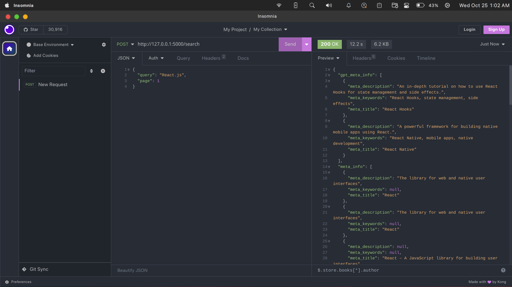

# Google Search with Superpowers 

> Please updated the .env file with your own OPEN_AI_KEY.

### Demo
---


### Steps to run the project
---
1. Clone the project
2. Run `pip install -r requirements.txt`
3. Run `python app.py`
4. API will be running on `http://localhost:5000`

### API Endpoints
---
/search - POST
``` json
{
    "query": "query string",
    "page": 1
}
```

### Response
---
```json
{   
    "gpt_meta_info": [{
			"meta_description": "meta_description",
            "meta_title": "meta_title",
            "meta_keywords": "meta_keywords"
    }],
	"meta_info": [
        {
            "meta_title": "meta_title",
            "meta_description": "meta_description",
            "meta_keywords": "meta_keywords",
        }
    ],
    "results": [
        {
            "title": "title",
            "link": "link",
            "description": "description"
        }
    ],
    "num_results": 10,
    "page_num": 1,
    "search_query": "query string"
}
```

### Error Response
---
```json
{
    "error": "error message"
}
```

### Environment Variables  - (.env)
---
```env
USE_FREE_PROXIES = Boolean
PAID_PROXY_API = URL
OPEN_AI_KEY = API_KEY
```

### Directory Structure
---
```bash
├── assets
│   ├── demo.png
│   ├── example_return_data.json
├── search
│   ├── __init__.py
│   ├── user_agents.py
│── utils
│   ├── proxyhandler.py
│   ├── valid_proxies.txt
│── logs
│   ├── error.log
├── app.py
├── README.md
├── requirements.txt
├── .gitignore
```
